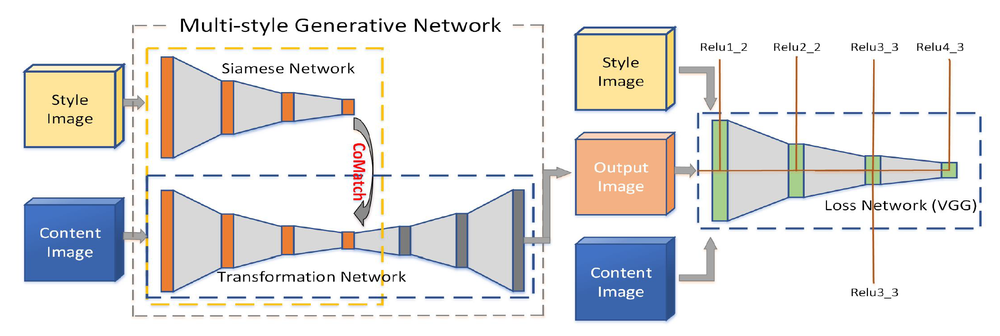

Multi-Style-Transfer
===
A CNN network for image-style transformation. 

Example Transformation
---
   

  

  

Network
---

The network architecture is shown, which is proposed in [Real-time Style Transfer](https://arxiv.org/pdf/1703.06953.pdf).

Requirement
---
* Hardware: tested with RTX 2080Ti (11G) $\times 1$
* Software: tested with Python 3.6, MXNet 1.6, CUDA 10.2

Train
---
We train our model on COCO dataset with batch size of 8, and the style dataset is WikiArt. The model is trained for total 13 epochs with learning rate 0.001 at the first 12 epoch and 0.0001 at the last epoch. \
The config files are under 'configs' like 'single_gpu.yaml'. \
You can train the model with single gpu device by run:
>bash train_single_gpu.sh 

In train_single_gpu.sh, '--config_path' means the path of your config file.

Eval
---
You can eval the trained model by run:
>bash eval.sh

The '--config_path' in eval.sh means the path of your config file. You should modeify the model path, content image and style image first.

Reference
---
[PyTorch-Multi-Style-Transfer](https://github.com/zhanghang1989/PyTorch-Multi-Style-Transfer)